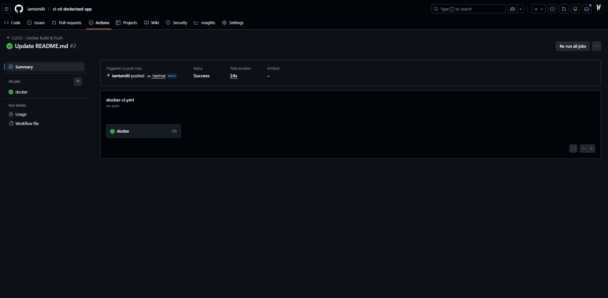
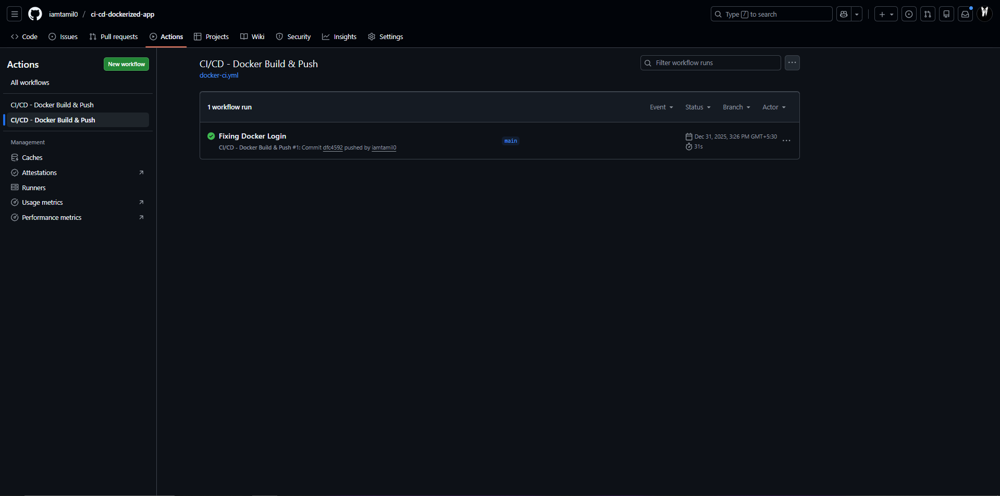
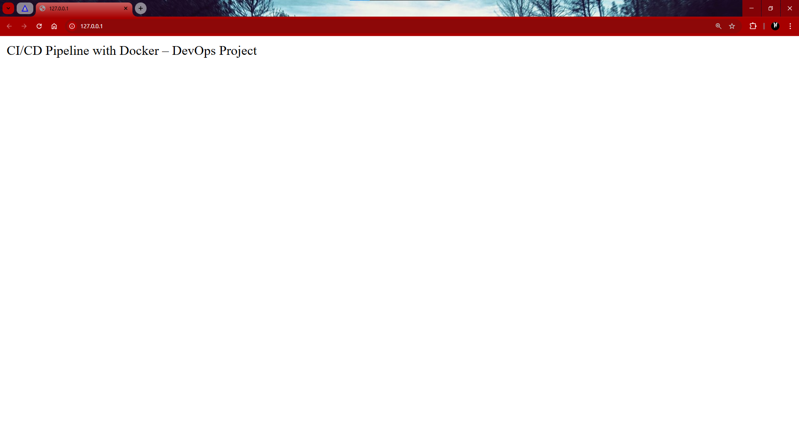

📌 Project: CI/CD Pipeline with Docker using GitHub Actions
🔍 Overview

This project demonstrates a real-world CI/CD pipeline where an application is automatically built, containerized, and pushed to Docker Hub using GitHub Actions, then deployed on AWS EC2 using Docker.

It reflects how DevOps engineers automate build and deployment workflows in production.

🛠️ Tech Stack

~ GitHub Actions (CI/CD)
~ Docker
~ Python (Flask)
~ AWS EC2 (Ubuntu)
~ Linux
~ Bash

⚙️ CI/CD Workflow

1. Developer pushes code to GitHub
2. GitHub Actions pipeline triggers automatically
3. Docker image is built
4. Image is pushed to Docker Hub
5. Application is deployed on AWS EC2

Code Push → GitHub Actions → Docker Build → Docker Hub → AWS EC2

📂 Project Structure

ci-cd-dockerized-app/
├── app.py
├── requirements.txt
├── Dockerfile
├── .github/workflows/docker-ci.yml
└── README.md

🐳 Docker Image

Docker Hub Repository:
https://hub.docker.com/r/iamtamil0/devops-cicd-app

🚀 GitHub Actions Pipeline

Workflow file:
.github/workflows/docker-ci.yml

~ Pipeline Tasks:
~ Checkout source code
~ Login to Docker Hub (using GitHub Secrets)
~ Build Docker image
~ Push image to Docker Hub

🔐 Security Best Practices

* Docker credentials stored using GitHub Secrets
* No hardcoded passwords
* Minimal base image (python:3.9-slim)
* AWS Security Groups restrict access

☁️ Deployment on AWS EC2
Steps:

sudo apt update
sudo apt install docker.io -y
sudo systemctl start docker
sudo usermod -aG docker ubuntu

Run container:
docker run -d --name devops-cicd-app -p 80:5000 iamtamil0/devops-cicd-app:latest

http://127.0.0.1/

📸 Screenshots
Add screenshots of:

🎯 Key Learnings

* End-to-end CI/CD automation
* Docker image lifecycle
* Secure secret management
* Cloud-based deployment
* Linux & DevOps troubleshooting

troubleshooting

🎤 Interview Questions This Project Answers

How does CI/CD work?

How do you use GitHub Actions?

How do you deploy Docker apps?

How do you secure pipelines?

📎 Author

Tamilmani N

🔗 GitHub: https://github.com/iamtamil0

🔗 LinkedIn: www.linkedin.com/in/ntamilmanin
